# Crypto Recommendation System

A Spring Boot application that provides cryptocurrency price analysis and recommendations based on normalized price ranges and historical data aggregation.

## 🏗️ Architecture

This project follows **Hexagonal Architecture** (also known as Ports and Adapters pattern), which provides a clean separation of concerns and makes the system more maintainable and testable.

### Architecture Layers

**Application Layer**
- Controllers (REST endpoints)
- DTOs & Mappers
- Exception handling

**Domain Layer**
- Services (Business logic)
- Aggregators (Price aggregation)
- Evaluators (Data evaluation)
- Domain Models (Entities)

**Infrastructure Layer**
- Repositories (Data access)
- JPA Entities & Database
- External adapters

```mermaid
graph TB
    subgraph "Application Layer"
        A1[Ingestion Controller<br/>POST /ingest]
        A2[Recommendation Controller<br/>GET /normalized-range]
        A3[Global Exception Handler<br/>Error Responses]
        A4[DTO Mappers<br/>Domain ↔ API]
        A5[Input Validation<br/>@NotBlank, @Validated]
    end
    
    subgraph "Domain Layer"
        B1[Ingestion Service<br/>File Processing]
        B2[Recommendation Service<br/>Price Analysis]
        C1[Crypto Rate<br/>Price Data Model]
        C2[Symbol Price<br/>Individual Prices]
        C3[Symbol Config<br/>Time Frames]
        C4[Symbol Lock<br/>Concurrency Control]
        C5[Price Aggregator<br/>Data Consolidation]
        C6[Price Evaluator<br/>Summary Creation]
        C7[Normalized Range<br/>Price Analysis]
        C8[File Readers<br/>CSV/TXT Interface & Impl]
    end
    
    subgraph "Infrastructure Layer (Ports)"
        D1[Symbol Price Repository<br/>JPA Implementation]
        D2[Symbol Config Repository<br/>Configuration Storage]
        D3[Symbol Lock Repository<br/>Lock Management]
        D4[Price Summary Repository<br/>Aggregated Data]
        D5[MapStruct Mappers<br/>Entity ↔ Domain]
        D6[Spring Security<br/>Authentication]
        D7[H2 Database<br/>In-Memory Storage]
        D8[Rate Limiting Filter<br/>Bucket4j]
    end
    
    %% Application to Domain connections
    A1 --> B1
    A2 --> B2
    A4 --> C1
    A4 --> C2
    A4 --> C3
    A4 --> C4
    
    %% Domain internal connections
    B1 --> C1
    B1 --> C2
    B1 --> C3
    B1 --> C4
    B1 --> C5
    B1 --> C8
    B2 --> C6
    B2 --> C7
    
    %% Domain to Infrastructure connections
    C1 --> D1
    C2 --> D1
    C3 --> D2
    C4 --> D3
    C5 --> D4
    C6 --> D4
    C7 --> D4
    
    %% Infrastructure internal connections
    D1 --> D5
    D2 --> D5
    D3 --> D5
    D4 --> D5
    D5 --> D7
    
    %% Security and Rate Limiting
    D6 --> A1
    D6 --> A2
    D8 --> A1
    D8 --> A2
    
    %% Styling
    classDef applicationLayer fill:#f3e5f5,stroke:#4a148c,stroke-width:2px
    classDef domainLayer fill:#e8f5e8,stroke:#1b5e20,stroke-width:2px
    classDef infrastructureLayer fill:#fff3e0,stroke:#e65100,stroke-width:2px
    
    class A1,A2,A3,A4,A5 applicationLayer
    class B1,B2,C1,C2,C3,C4,C5,C6,C7,C8 domainLayer
    class D1,D2,D3,D4,D5,D6,D7,D8 infrastructureLayer
```

### Key Benefits of Hexagonal Architecture

- **Dependency Inversion**: Domain layer doesn't depend on infrastructure
- **Testability**: Easy to unit test business logic in isolation
- **Flexibility**: Can easily swap implementations (e.g., different databases)
- **Maintainability**: Clear separation of concerns
- **Scalability**: Easy to add new features without affecting existing code

## 🚀 Features

- **Cryptocurrency Data Ingestion**: Process CSV and TXT files with historical price data
- **Price Aggregation**: Aggregate prices by time periods (monthly, half-yearly, yearly)
- **Normalized Range Calculation**: Calculate and compare price volatility across different cryptocurrencies
- **Recommendation Engine**: Provide recommendations based on normalized price ranges
- **Real-time Analysis**: Get highest performing symbols for specific dates
- **Caching**: Optimized performance with Spring Cache
- **Rate Limiting**: API protection with Bucket4j
- **Security**: Spring Security integration

## 🛠️ Technology Stack

- **Java 21** - Latest LTS version with modern language features
- **Spring Boot 3.5.4** - Modern Spring framework
- **Spring Data JPA** - Data persistence layer
- **H2 Database** - In-memory database for development
- **MapStruct** - Type-safe object mapping
- **Lombok** - Reduce boilerplate code
- **Spring Security** - Authentication and authorization
- **Bucket4j** - Rate limiting implementation
- **Gradle** - Build tool

## ⚡ Performance & Scalability

- **Caching Strategy**: Spring Cache with Caffeine for price data
- **Concurrency Control**: Symbol locking mechanism for parallel processing
- **Rate Limiting**: Bucket4j with configurable limits
- **Database Optimization**: JPA with proper indexing strategies
- **Memory Management**: Efficient data aggregation algorithms

## 🔒 Security & Reliability

- **Authentication**: Spring Security with basic auth
- **Input Validation**: Comprehensive parameter validation
- **Error Handling**: Global exception handler with structured responses
- **Data Integrity**: Transactional operations and conflict detection
- **API Protection**: Rate limiting and request validation

## 📈 Business Value

- **Cryptocurrency Analysis**: Real-time price volatility assessment
- **Investment Insights**: Data-driven recommendations based on historical patterns
- **Risk Assessment**: Normalized range calculations for portfolio management
- **Data Processing**: Efficient handling of large-scale financial datasets

## 🚀 Getting Started

### Prerequisites

- Java 21 or higher
- Gradle 8.0 or higher

## API Endpoints

### Ingestion
- `GET /api/v1/ingestion/start?directory={path}` - Process cryptocurrency data files
- `GET /h2-console` - Database management interface (H2 Console)

### Recommendations
- `GET /api/v1/recommendation/normalized-range` - Get all symbols with normalized price ranges (descending)
- `GET /api/v1/recommendation/normalized-range/highest?date={yyyy-MM-dd}` - Get highest performing symbol for specific date
- `GET /api/v1/recommendation/summary/{symbol}/info` - Get detailed stats for specific cryptocurrency

### Authentication
- All endpoints require basic authentication
- Default credentials: `admin` / `admin`

